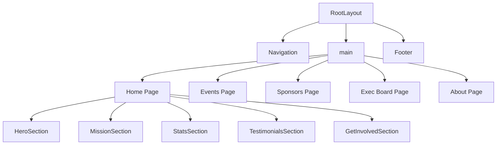

# Design Document: Design Revamp

## Overview

This design reimagines the ColorStack at Ohio State website as an **editorial-brutalist hybrid** — a site that feels like a printed magazine collided with a digital-native experience. The aesthetic direction is "bold print culture meets kinetic web": high-contrast typography, dramatic spatial composition, layered atmospheric depth, and choreographed motion that makes every scroll feel intentional.

**Conceptual Direction:** The site should feel like opening a beautifully art-directed issue of a magazine about the future of tech diversity. Every section is a spread. Every transition is a page turn. The visitor should remember: _this site has a point of view._

**Key Differentiator:** Instead of the conventional student org website pattern (hero → cards → footer), the redesign uses **editorial spreads** — full-viewport compositions where typography, imagery, and negative space work together as a unified layout rather than stacked blocks.

### Tech Stack (Preserved)

- **Next.js 15** with App Router
- **Tailwind CSS 3** with extended theme configuration
- **GSAP** for scroll-triggered and choreographed animations
- **TypeScript** throughout
- **next/font** for optimized font loading
- **Vitest + fast-check** for testing

---

## Architecture

### Design System Architecture

The design system is built on three layers:

```
┌─────────────────────────────────────────────┐
│  Layer 3: Component Styles                  │
│  (Tailwind utilities + component classes)   │
├─────────────────────────────────────────────┤
│  Layer 2: Tailwind Theme Extensions         │
│  (references CSS custom properties)         │
├─────────────────────────────────────────────┤
│  Layer 1: CSS Custom Properties (tokens)    │
│  (colors, typography, spacing, motion)      │
└─────────────────────────────────────────────┘
```

**Layer 1 — CSS Custom Properties** define the raw design tokens in `globals.css` under `:root`. These are the single source of truth for every visual value.

**Layer 2 — Tailwind Theme** in `tailwind.config.ts` references these CSS custom properties, making them available as utility classes (`text-display`, `bg-brand-red`, `gap-space-md`, etc.).

**Layer 3 — Components** consume Tailwind utilities exclusively. No hardcoded hex values, pixel sizes, or magic numbers in component files.

### Font Loading Architecture

```
app/layout.tsx
├── import { Syne } from "next/font/google"        → Display font
├── import { Source_Serif_4 } from "next/font/google" → Body font
├── Apply CSS variables: --font-display, --font-body
└── <html className={`${syne.variable} ${sourceSerif.variable}`}>
```

Both fonts are loaded through `next/font/google` for automatic optimization, subsetting, and zero layout shift. CSS variables are set on `<html>` and consumed by Tailwind's `fontFamily` configuration.

### Animation Architecture

```
┌──────────────────────────────────────────┐
│  GSAP ScrollTrigger (orchestration)      │
│  - Page-load choreography                │
│  - Scroll-triggered sequences            │
│  - Parallax and scrub effects            │
├──────────────────────────────────────────┤
│  CSS Transitions (micro-interactions)    │
│  - Hover states                          │
│  - Focus indicators                      │
│  - Simple reveals                        │
├──────────────────────────────────────────┤
│  CSS Keyframe Animations (ambient)       │
│  - Gradient mesh movement                │
│  - Grain overlay flicker                 │
│  - Sponsor logo scroll                   │
└──────────────────────────────────────────┘
```

GSAP handles the heavy orchestration (staggered reveals, scroll-linked parallax, timeline sequences). CSS handles everything that doesn't need JavaScript coordination. This keeps the animation budget lean — GSAP only fires when choreography matters.

### Page Structure



---

## Components and Interfaces

### Design Tokens (CSS Custom Properties)

```css
:root {
  /* ── Brand Colors ── */
  --color-brand-red: #b9283d;
  --color-brand-red-hover: #d30f36;
  --color-brand-dark: #202020;
  --color-brand-light: #f8f8f8;
  --color-brand-bg: #f2f2f2;

  /* ── Extended Palette ── */
  --color-brand-red-muted: #8a1e2e; /* Deep red for dark backgrounds */
  --color-brand-red-light: #f0d0d5; /* Blush tint for subtle backgrounds */
  --color-brand-cream: #faf5f0; /* Warm off-white for editorial feel */
  --color-brand-charcoal: #2d2d2d; /* Slightly lighter than dark */
  --color-brand-slate: #6b6b6b; /* Mid-tone for secondary text */

  /* ── Typography Scale ── */
  --text-hero: clamp(3.5rem, 8vw, 7rem);
  --text-display: clamp(2rem, 4vw, 3.5rem);
  --text-heading: clamp(1.5rem, 2.5vw, 2rem);
  --text-subheading: clamp(1.125rem, 1.5vw, 1.375rem);
  --text-body: clamp(0.9375rem, 1vw, 1.0625rem);
  --text-caption: clamp(0.75rem, 0.85vw, 0.875rem);
  --text-overline: 0.6875rem;

  /* ── Spacing Scale ── */
  --space-xs: 0.25rem; /* 4px */
  --space-sm: 0.5rem; /* 8px */
  --space-md: 1rem; /* 16px */
  --space-lg: 2rem; /* 32px */
  --space-xl: 4rem; /* 64px */
  --space-2xl: 6rem; /* 96px */
  --space-3xl: 10rem; /* 160px */
  --space-section: clamp(4rem, 8vw, 8rem);

  /* ── Motion Tokens ── */
  --ease-out-expo: cubic-bezier(0.16, 1, 0.3, 1);
  --ease-out-quart: cubic-bezier(0.25, 1, 0.5, 1);
  --ease-in-out-sine: cubic-bezier(0.37, 0, 0.63, 1);
  --duration-fast: 200ms;
  --duration-normal: 400ms;
  --duration-slow: 800ms;
  --duration-reveal: 1200ms;
}
```

### Typography System

**Display Font: Syne**

- Designed by Bonjour Monde (Lucas Descroix), available on Google Fonts
- Geometric sans-serif with distinctive character — wide letterforms, sharp angles, and a confident personality
- Used for: h1, h2, hero text, stat values, pull quotes, section titles
- Rationale: Syne has the boldness and geometric precision that communicates "tech-forward" while its quirky proportions prevent it from feeling corporate. It's distinctive without being illegible.

**Body Font: Source Serif 4**

- Designed by Frank Grießhammer for Adobe, available on Google Fonts
- Transitional serif with excellent screen readability and multiple optical sizes
- Used for: paragraph text, labels, navigation, captions, UI elements
- Rationale: The serif/sans-serif pairing creates strong typographic contrast. Source Serif 4 brings warmth and editorial credibility — it reads like a magazine, not a tech startup. Its optical size variants ensure crisp rendering at every scale.

**Why this pairing works:** Syne's geometric boldness against Source Serif 4's refined curves creates a tension between "future" and "craft" — exactly the duality ColorStack embodies (tech industry + community/culture).

```typescript
// app/layout.tsx
import { Syne } from "next/font/google";
import { Source_Serif_4 } from "next/font/google";

const syne = Syne({
  subsets: ["latin"],
  variable: "--font-display",
  display: "swap",
});

const sourceSerif = Source_Serif_4({
  subsets: ["latin"],
  variable: "--font-body",
  display: "swap",
});
```

### Tailwind Configuration

```typescript
// tailwind.config.ts (extended theme)
{
  theme: {
    extend: {
      colors: {
        brand: {
          red: "var(--color-brand-red)",
          "red-hover": "var(--color-brand-red-hover)",
          "red-muted": "var(--color-brand-red-muted)",
          "red-light": "var(--color-brand-red-light)",
          dark: "var(--color-brand-dark)",
          light: "var(--color-brand-light)",
          bg: "var(--color-brand-bg)",
          cream: "var(--color-brand-cream)",
          charcoal: "var(--color-brand-charcoal)",
          slate: "var(--color-brand-slate)",
        },
      },
      fontFamily: {
        display: ["var(--font-display)", "sans-serif"],
        body: ["var(--font-body)", "Georgia", "serif"],
      },
      fontSize: {
        hero: "var(--text-hero)",
        display: "var(--text-display)",
        heading: "var(--text-heading)",
        subheading: "var(--text-subheading)",
        body: "var(--text-body)",
        caption: "var(--text-caption)",
        overline: "var(--text-overline)",
      },
      spacing: {
        "space-xs": "var(--space-xs)",
        "space-sm": "var(--space-sm)",
        "space-md": "var(--space-md)",
        "space-lg": "var(--space-lg)",
        "space-xl": "var(--space-xl)",
        "space-2xl": "var(--space-2xl)",
        "space-3xl": "var(--space-3xl)",
        "space-section": "var(--space-section)",
      },
      transitionTimingFunction: {
        "out-expo": "var(--ease-out-expo)",
        "out-quart": "var(--ease-out-quart)",
        "in-out-sine": "var(--ease-in-out-sine)",
      },
      transitionDuration: {
        fast: "var(--duration-fast)",
        normal: "var(--duration-normal)",
        slow: "var(--duration-slow)",
        reveal: "var(--duration-reveal)",
      },
    },
  },
}
```

### Component Design Decisions

#### Navigation

**Design:** A minimal, transparent-to-solid navigation bar. On scroll, the nav gains a frosted-glass backdrop (`backdrop-blur`) and a subtle bottom border. The logo sits left, links sit right. No background color on initial load — the nav floats over the hero content.

- **Desktop (992px+):** Horizontal link row with the display font at overline size, uppercase, tracked wide. Hover state: a red underline slides in from center. Active page indicated by persistent red dot below the link.
- **Mobile (<992px):** Full-screen overlay menu. Links stack vertically, centered, at display scale. Menu opens with a staggered reveal — each link slides in from the right with 80ms delay between items. Close button is an animated X morph from the hamburger.
- **Sticky behavior:** `position: sticky; top: 0` with `backdrop-filter: blur(12px)` and `bg-white/80` when scrolled past the hero.

#### Hero Area

**Design:** A full-viewport editorial spread. The hero photo bleeds to the left edge at roughly 55% width. The headline text sits on the right, overlapping the photo edge slightly — creating a layered, magazine-cover composition.

- **Headline treatment:** "Welcome to" in Source Serif 4 italic (small, understated), then "ColorStack" in Syne at `--text-hero` scale (massive, red), then "at Ohio State" in Syne at a smaller display scale. The text stack is left-aligned with generous line-height.
- **Entrance animation (GSAP timeline):**
  1. Photo clips in from left (clip-path reveal, 0.8s)
  2. "Welcome to" fades up (0.4s, 0.3s delay)
  3. "ColorStack" slides in from right (0.6s, 0.5s delay)
  4. "at Ohio State" fades up (0.4s, 0.7s delay)
  5. CTA button scales in (0.3s, 1.0s delay)
  6. Sponsor scroller fades in (0.4s, 1.2s delay)
- **Sponsor scroller:** Positioned at the bottom of the hero, full-width. Continuous horizontal scroll with CSS animation. Logos rendered in grayscale with `filter: grayscale(1) opacity(0.6)`, transitioning to full color on section hover.
- **Atmospheric effect:** A radial gradient mesh behind the text area — soft red-to-cream gradient that slowly shifts position via CSS animation. Overlaid with a subtle noise texture (CSS `background-image` with inline SVG noise pattern) at 3-5% opacity.
- **Mobile:** Photo moves above the text, taking full width with a gradient fade at the bottom. Text stacks below. Sponsor scroller remains at the bottom.

#### Mission Section

**Design:** Dark background (`--color-brand-dark`) with a magazine-style layout. The mission statement is a large pull-quote treatment — Syne at display scale, centered, with a thin red rule above and below.

- **Program pillars:** Three cards arranged in an asymmetric grid. On desktop, the first card is large (spans 2 columns), the other two stack vertically beside it. Each card has the photo as background with a dark gradient overlay, and the title + description overlaid in white text.
- **Transition in:** Cards stagger in from different directions — first card from left, second from right, third from bottom.
- **Mobile:** Single column, each card full-width with the photo above and text below.

#### Stats Section

**Design:** A full-width section with a dramatic typographic treatment. Instead of ribbons, the stats are presented as a **typographic wall** — the numbers rendered at massive scale (Syne, `--text-hero` size) in a 3×2 grid on desktop, with labels in Source Serif 4 caption size below each number.

- **Color treatment:** Alternating between brand-red numbers on light background and white numbers on dark background, creating a checkerboard-like visual rhythm.
- **Scroll animation:** Each number counts up from 0 to its value using GSAP, triggered when the section enters the viewport. The count-up is staggered left-to-right, top-to-bottom.
- **Section transition:** The section uses a diagonal clip-path that creates an angled edge between the mission section above and the stats section, rather than a horizontal SVG divider.
- **Mobile:** 2-column grid with the numbers at a smaller but still impactful scale. The count-up animation is preserved.

#### Testimonials Section

**Design:** An editorial quote layout inspired by magazine feature spreads. Each testimonial gets a **full-width treatment** — the student's photo on one side, a large pull-quote on the other, with their name and year as a byline.

- **Desktop:** Horizontal scroll or paginated view. Each "spread" is a two-column layout: photo left (40%), quote right (60%). The quote text uses Source Serif 4 at subheading scale with a large red opening quotation mark (Syne, decorative) positioned as an oversized background element.
- **Navigation:** Subtle arrow buttons and dot indicators. Transition between testimonials uses a crossfade with slight horizontal slide.
- **Tablet:** Same layout but with reduced photo width.
- **Mobile:** Stacked — photo above (circular crop, centered), quote below. Swipeable or vertically stacked.

#### Get Involved (Calls to Action)

**Design:** Three distinct CTA blocks arranged as an asymmetric triptych. The primary CTA ("Join The Community") is visually dominant — larger, red background, centered. The secondary CTAs flank it at smaller scale.

- **Layout:** On desktop, the three CTAs sit in a row but with the center one elevated and scaled up (transform: scale(1.05) translateY(-1rem)). This creates a visual hierarchy without needing different card designs.
- **Hover effect:** Cards tilt slightly toward the cursor (CSS perspective transform) and gain a subtle shadow depth increase.
- **Typography:** Title in Syne (display font), subtitle in Source Serif 4 italic.

#### Footer

**Design:** Dark background with a clean, editorial layout. The logo sits top-left. Navigation links are arranged horizontally with the same underline hover animation as the main nav. Social icons use the brand red as fill color, arranged in a horizontal row.

- **Layout:** Two-row structure. Top row: logo left, nav links right. Bottom row: social icons centered, copyright centered below.
- **Mobile:** Everything stacks and centers.

#### Event Card

**Design:** A card with the thumbnail image taking the full card area as a background, with a dark gradient overlay from bottom. Event name in Syne (white, bold) and date in Source Serif 4 (red) sit at the bottom of the card over the gradient.

- **Hover:** The image scales up slightly (1.05) and the gradient overlay shifts to a red tint. A subtle border appears.
- **Aspect ratio:** 16:10 for a cinematic feel.

#### Member Card

**Design:** Clean, minimal. Circular photo with a thin red border on hover. Name in Source Serif 4 (body font, semibold), position in caption size. Company logo below at a small, consistent size.

- **Interactive cards (with bio):** On hover, the photo gains a red-tinted overlay and a "View Bio" text fades in at center.
- **Grid:** 4 columns on desktop, 3 on tablet, 2 on mobile.

### Section Transitions

Instead of SVG shape dividers, the redesign uses **three transition techniques** applied consistently:

1. **Diagonal clip-path:** A CSS `clip-path: polygon()` that creates an angled edge (roughly 3-4° tilt). Used between sections with different background colors.
2. **Gradient bleed:** A CSS gradient that transitions from one section's background color to the next over ~80px of vertical space. Used between sections with similar tones.
3. **Overlap:** The next section's content overlaps the previous section by a negative margin, creating a layered depth effect. Used sparingly for high-impact moments (e.g., stats overlapping mission).

### Atmospheric Effects

- **Gradient mesh:** Animated radial gradients using CSS `background` with multiple gradient layers. Colors derived from brand palette (red, cream, light). Animated with `background-position` shifts.
- **Noise texture:** An inline SVG `<filter>` generating Perlin noise, applied as a `background-image` at 3-5% opacity. This adds a film-grain quality that prevents flat digital surfaces.
- **Applied to:** Hero area (gradient mesh + noise), testimonials section (subtle gradient mesh), and the stats section (noise texture on dark panels).

### Scroll-Triggered Motion System

The existing `RevealAnimator` component and `useReveal` hook are preserved but enhanced:

- **New variants added:** `clip-up` (clip-path reveal from bottom), `blur-in` (blur to sharp), `counter` (number count-up)
- **GSAP integration:** For sections requiring orchestrated sequences (hero, stats), GSAP `ScrollTrigger` is used directly in the component rather than through `RevealAnimator`.
- **Performance:** All animated elements use `will-change: transform, opacity` and are promoted to their own compositor layer. Animations target only `transform` and `opacity` for 60fps.

### Responsive Strategy

| Breakpoint | Width         | Layout Approach                                         |
| ---------- | ------------- | ------------------------------------------------------- |
| Mobile     | < 768px       | Single column, stacked sections, reduced type scale     |
| Tablet     | 768px – 991px | Two-column where appropriate, intermediate type scale   |
| Desktop    | ≥ 992px       | Full editorial layouts, maximum type scale, all effects |

- **Fluid typography:** All type sizes use `clamp()` for smooth scaling between breakpoints.
- **Touch targets:** All interactive elements maintain minimum 44×44px tap area on mobile.
- **Reduced motion:** `@media (prefers-reduced-motion: reduce)` disables all animations and transitions, showing content in its final state immediately.

---

## Data Models

No new data models are introduced. The design revamp is purely a visual/presentational change. All existing data structures are preserved:

- **`EventItem`** — event name, date, thumbnail, drive folder ID
- **`BoardMember`** — name, position, photo, bio, company logo
- **`Sponsor`** — name, logo, tier, description
- **Testimonial data** — name, year, title, quote, photo (currently inline in component)
- **Stats data** — value, label (currently inline in component)
- **Navigation links** — href, label, external flag

The design tokens themselves are not TypeScript data models — they live in CSS custom properties and Tailwind configuration.

---

## Correctness Properties

_A property is a characteristic or behavior that should hold true across all valid executions of a system — essentially, a formal statement about what the system should do. Properties serve as the bridge between human-readable specifications and machine-verifiable correctness guarantees._

This feature is primarily a visual/UI design revamp, so most acceptance criteria relate to rendering, layout, and animation — areas where property-based testing has limited applicability. However, the accessibility color contrast requirements are mathematical properties that benefit from PBT.

### Property 1: WCAG Color Contrast Compliance

_For any_ text/background color pair defined in the design system tokens, the computed WCAG 2.1 contrast ratio SHALL meet the minimum threshold for its usage context: ≥ 4.5:1 for body-sized text (below 18px regular or 14px bold) and ≥ 3:1 for large text (18px+ regular or 14px+ bold).

**Validates: Requirements 17.1, 17.2**

---

## Error Handling

Since this is a visual design revamp with no new data flows, API calls, or user input processing, error handling is limited to graceful degradation:

### Font Loading Failures

- **Strategy:** Both fonts are loaded with `display: "swap"`, so the browser renders text immediately with a fallback font and swaps when the custom font loads. If Google Fonts is unreachable, the Tailwind `fontFamily` config includes fallback stacks (`sans-serif` for display, `Georgia, serif` for body).
- **Impact:** The site remains fully functional and readable — just with less distinctive typography.

### Animation Failures

- **Strategy:** All content is rendered in its final visible state in the DOM. Animations only modify `opacity` and `transform` — if GSAP fails to load or JavaScript is disabled, content is visible but static.
- **Fallback:** CSS animations (gradient mesh, sponsor scroll) work independently of JavaScript. GSAP-dependent animations (hero choreography, stat count-up) degrade to static content.
- **Reduced motion:** `@media (prefers-reduced-motion: reduce)` sets all transitions to `0s` and shows content in final state.

### Image Loading Failures

- **Strategy:** All images use Next.js `<Image>` with appropriate `alt` text. If an image fails to load, the alt text is displayed. Event card thumbnails have a loading skeleton (pulse animation) and fall back to a placeholder image.
- **Member photos:** Fall back to the existing `blank-profile.png` placeholder.

### CSS Custom Property Failures

- **Strategy:** Tailwind utilities that reference CSS custom properties will fall back to the browser's default if a variable is undefined. The design tokens are defined in `:root` which loads before any component renders, making this scenario unlikely outside of development errors.

### Responsive Layout Overflow

- **Strategy:** All sections use `overflow-hidden` on their containers. The diagonal clip-path transitions are tested to not extend beyond viewport bounds. The `max-w-screen` constraint prevents any element from exceeding viewport width.

---

## Testing Strategy

### Assessment: Property-Based Testing Applicability

This feature is a **visual design revamp** — the vast majority of requirements concern UI rendering, layout composition, animation choreography, and subjective design quality. These are areas where PBT has limited value. However, the WCAG color contrast requirements (17.1, 17.2) are mathematical properties that benefit from property-based testing across the full space of color pairings in the design system.

**PBT applies to:** Color contrast compliance (1 property)
**PBT does not apply to:** UI rendering, layout, animation, typography application, responsive behavior, subjective design quality

### Dual Testing Approach

#### Property-Based Tests (Vitest + fast-check)

One property test covering WCAG contrast compliance:

- **Library:** fast-check (already installed)
- **Configuration:** Minimum 100 iterations per property
- **Tag format:** `Feature: design-revamp, Property 1: WCAG Color Contrast Compliance`

The test generates random pairings from the defined text colors and background colors in the design system, computes the WCAG 2.1 relative luminance contrast ratio, and verifies it meets the appropriate threshold (4.5:1 for body text, 3:1 for large text).

#### Unit Tests (Vitest + Testing Library)

Example-based tests covering component rendering and content presence:

| Test Area           | What's Verified                                                                                                             | Criteria               |
| ------------------- | --------------------------------------------------------------------------------------------------------------------------- | ---------------------- |
| Design tokens       | CSS custom properties exist for all brand colors, typography scale (4+ steps), spacing scale (5+ tokens), motion primitives | 1.1–1.7                |
| Font configuration  | Tailwind config references display and body font families; banned fonts (Inter, Roboto, Arial) are not primary              | 2.1–2.5                |
| Navigation          | Logo, all page links present; mobile menu collapses; sticky positioning; all destinations preserved                         | 3.1, 3.2, 3.4, 3.6     |
| Hero                | Headline text, display font usage, CTA link, community photo, sponsor logos present                                         | 4.1–4.5                |
| Mission             | Heading with display font, three pillars with images/descriptions, dark background, Learn More link                         | 5.1, 5.2, 5.5, 5.6     |
| Stats               | All six stats rendered, display font on values, brand colors used                                                           | 6.1, 6.2, 6.4          |
| Testimonials        | All four testimonials with required fields, display font on titles, navigation mechanism                                    | 7.1, 7.2, 7.5          |
| CTAs                | Three CTAs present, Join The Community has red styling, correct hrefs, font usage                                           | 8.1, 8.2, 8.4, 8.5     |
| RevealAnimator      | Supports fade, scale, slide variants; accepts delay props; uses will-change                                                 | 10.2, 10.3, 10.5       |
| Atmospheric effects | Present on hero + one other section, brand palette colors, low opacity                                                      | 11.1–11.3              |
| Sponsor scroller    | All logos rendered, animation class, consistent sizing, hover pause CSS                                                     | 12.1–12.4              |
| Event Card          | Name, date, image rendered; display/body font usage; click handler; brand color overlay                                     | 13.1, 13.2, 13.4, 13.5 |
| Member Card         | Photo, name, position, company logo; interactive when bio exists; body font; consistent photo size                          | 14.1, 14.2, 14.4, 14.5 |
| Footer              | Logo, nav links, social icons, copyright; dark background; body font; red accent on social icons                            | 15.1, 15.2, 15.4, 15.5 |
| Responsive          | Breakpoints defined; fluid typography with clamp()                                                                          | 16.1, 16.5             |
| Accessibility       | Focus indicators; ARIA labels; semantic HTML; animated content not hidden from screen readers                               | 17.3–17.6              |

#### Integration / Visual Regression Tests

These require a browser environment and are outside the scope of unit testing:

- **Overflow check (9.4, 16.6):** Verify no horizontal scrolling at viewport widths 320px–1920px
- **Keyboard navigation (17.7):** Verify Tab navigation through all interactive elements
- **Animation choreography (4.6, 6.5):** Verify GSAP timelines execute in correct sequence

These should be run manually or with a tool like Playwright/Cypress in a CI pipeline.

### Test Configuration

```typescript
// Property test tag format
// Feature: design-revamp, Property 1: WCAG Color Contrast Compliance

// Minimum iterations for property tests
const PBT_MIN_RUNS = 100;
```
