# Design Document: Next.js + Tailwind CSS Migration

## Overview

This design describes the migration of the ColorStack at Ohio State static website from a Bootstrap 5 + vanilla HTML/CSS/JS stack to a Next.js 14+ App Router application styled with Tailwind CSS. The migration preserves all existing functionality — five pages, scroll-triggered animations, Google Drive photo galleries, dynamic board member rendering, sponsor form submission, and responsive layouts — while introducing TypeScript type safety, component-based architecture, optimized image delivery, and modern font loading.

The existing site consists of five HTML pages (`index.html`, `events.html`, `execboard.html`, `sponsors.html`, `about.html`), a single CSS file (~1800 lines), and several JS modules handling reveal animations, GSAP scroll effects, event card rendering with Drive gallery integration, and executive board member rendering with modal interactions. Bootstrap provides the grid system, navbar, modals, carousels, dropdowns, and utility classes.

The new architecture replaces Bootstrap entirely with Tailwind utility classes and headless component patterns. Server components handle static content, while client components manage interactive behavior (modals, carousels, dropdowns, animations). Data files become typed TypeScript modules, and the Google Drive API key moves from a client-side `config.js` to a `NEXT_PUBLIC_` environment variable.

## Architecture

### Technology Stack

| Layer              | Current                  | Target                                                    |
| ------------------ | ------------------------ | --------------------------------------------------------- |
| Framework          | Static HTML              | Next.js 14+ (App Router)                                  |
| Language           | JavaScript               | TypeScript                                                |
| Styling            | Bootstrap 5 + custom CSS | Tailwind CSS v3+                                          |
| Font Loading       | Google Fonts `<link>`    | `next/font/google`                                        |
| Image Optimization | None                     | `next/image`                                              |
| Routing            | File-based HTML links    | Next.js file-based routing                                |
| Animations         | Custom CSS + GSAP        | Custom CSS (Tailwind) + GSAP                              |
| Icons              | Bootstrap Icons CDN      | `react-icons` (Bootstrap icon set) or Bootstrap Icons CDN |

### App Router Structure

```
app/
├── layout.tsx              # Root layout (Navigation + Footer)
├── page.tsx                # Home page (/)
├── events/
│   └── page.tsx            # Events page (/events)
├── sponsors/
│   └── page.tsx            # Sponsors page (/sponsors)
├── execboard/
│   └── page.tsx            # Exec Board page (/execboard)
├── about/
│   └── page.tsx            # About page (/about)
├── globals.css             # Tailwind directives + custom animations
└── favicon.ico
```

### Component Architecture

```mermaid
graph TD
    RootLayout["RootLayout (Server)"]
    Nav["Navigation (Client)"]
    Footer["Footer (Server)"]

    RootLayout --> Nav
    RootLayout --> Footer

    subgraph "Home Page"
        HP["HomePage (Server)"]
        Hero["HeroSection (Client)"]
        SponsorScroller["SponsorScroller (Client)"]
        Mission["MissionSection (Server)"]
        Stats["StatsSection (Client)"]
        Testimonials["TestimonialsSection (Client)"]
        GetInvolved["GetInvolvedSection (Server)"]

        HP --> Hero
        Hero --> SponsorScroller
        HP --> Mission
        HP --> Stats
        HP --> Testimonials
        HP --> GetInvolved
    end

    subgraph "Events Page"
        EP["EventsPage (Server)"]
        Calendar["CalendarEmbed (Client)"]
        EventGrid["EventGrid (Client)"]
        EventCard["EventCard (Client)"]
        GalleryModal["GalleryModal (Client)"]

        EP --> Calendar
        EP --> EventGrid
        EventGrid --> EventCard
        EventGrid --> GalleryModal
    end

    subgraph "Exec Board Page"
        EBP["ExecBoardPage (Client)"]
        YearSelector["YearSelector (Client)"]
        MemberGrid["MemberGrid (Client)"]
        MemberCard["MemberCard (Client)"]
        MemberModal["MemberModal (Client)"]

        EBP --> YearSelector
        EBP --> MemberGrid
        MemberGrid --> MemberCard
        MemberGrid --> MemberModal
    end

    subgraph "Sponsors Page"
        SP["SponsorsPage (Server)"]
        SponsorHeader["SponsorHeader (Server)"]
        SponsorTier["SponsorTier (Server)"]
        SponsorEntry["SponsorEntry (Server)"]
        SponsorForm["SponsorForm (Client)"]

        SP --> SponsorHeader
        SP --> SponsorTier
        SponsorTier --> SponsorEntry
        SP --> SponsorForm
    end

    subgraph "About Page"
        AP["AboutPage (Client)"]
        AboutHero["AboutHero (Server)"]
        AboutUs["AboutUsSection (Server)"]
        ContactUs["ContactUsSection (Server)"]

        AP --> AboutHero
        AP --> AboutUs
        AP --> ContactUs
    end
```



### Server vs Client Component Strategy

**Server Components** (default) are used for static content that does not require browser APIs or interactivity:

- Root layout, Footer, Mission section, Sponsor tier listings, About page content sections, Sponsor header

**Client Components** (`"use client"`) are used when the component needs:

- Browser event listeners (scroll, click, resize): Navigation, RevealAnimator, StatsSection
- React state management: GalleryModal, MemberModal, YearSelector, TestimonialsSection, SponsorForm
- Browser APIs (`window`, `IntersectionObserver`): SponsorScroller, HeroSection
- Third-party client libraries: GSAP animations

## Components and Interfaces

### Shared Components

#### `Navigation` (Client Component)

- Renders the sticky top navbar with logo, page links, and "About Us" dropdown
- Manages mobile hamburger menu open/close state
- Uses Next.js `Link` for internal navigation
- Props: none (self-contained)

#### `Footer` (Server Component)

- Renders logo, page links, social media icon buttons, and dynamic copyright year
- Conditionally shows "Home" link on small viewports via Tailwind responsive classes (`md:hidden`)
- Uses Next.js `Link` for internal navigation

#### `RevealAnimator` (Client Component)

- Wraps children with scroll-triggered reveal animation
- Props: `variant` (`"fade-up" | "scale-forward" | "slide-left" | "slide-right"`), `delay` (`100 | 200 | 300 | 400 | 500`), `className`
- Uses `IntersectionObserver` to add the `active` class when the element enters the viewport
- Performs initial check on mount for elements already in view

### Home Page Components

#### `HeroSection` (Client Component)

- Renders welcome heading with typewriter CSS animation, "Become a Member" CTA button
- Displays hero image on large viewports
- Contains the `SponsorScroller` sub-component

#### `SponsorScroller` (Client Component)

- Infinite horizontal scrolling banner of sponsor logo `` elements
- Duplicates the logo set for seamless looping via CSS `@keyframes slide`
- Pauses animation on hover (large viewports only)

#### `MissionSection` (Server Component)

- Dark background section with mission statement, "Learn More" link, and three mission cards
- Each card has an image (using `next/image`), title, and description

#### `StatsSection` (Client Component)

- Renders two ribbon banners (red and dark) on medium+ viewports with six statistics
- Renders a vertically stacked subset on small viewports with GSAP scroll-triggered scaling
- Uses `RevealAnimator` for entrance animations

#### `TestimonialsSection` (Client Component)

- Manages carousel state (current slide index) for large viewports
- Renders horizontal row on medium viewports, stacked cards on small viewports
- Each testimonial card contains quote title, text, student photo, name, and class year

#### `GetInvolvedSection` (Server Component)

- Renders three call-to-action cards linking to Sponsors, Slack, and Contact sections

### Events Page Components

#### `CalendarEmbed` (Client Component)

- Renders the Styled Calendar iframe
- Loads the Styled Calendar parent-window script

#### `EventGrid` (Client Component)

- Renders `EventCard` components from events data
- Manages gallery modal open/close state and selected event
- Contains the `GalleryModal` component

#### `EventCard` (Client Component)

- Displays event thumbnail (fetched from Drive or placeholder), name, and date
- Thumbnail is the first image from the event's Drive folder
- Clickable to open the gallery modal

#### `GalleryModal` (Client Component)

- Modal overlay displaying a grid of photo thumbnails
- Fetches images from Google Drive via `DriveGalleryService`
- Supports full-size image viewing on thumbnail click
- Shows loading, error, and empty states

### Exec Board Page Components

#### `YearSelector` (Client Component)

- Renders year-selection buttons for each academic year in the data
- Manages active year state, defaults to most recent year

#### `MemberGrid` (Client Component)

- Renders `MemberCard` components for the selected year
- Handles grid balancing (spacers when last row has exactly 2 members on large viewports)
- Contains the `MemberModal` component

#### `MemberCard` (Client Component)

- Displays member photo, name, position, and optional company logo
- Photo is clickable (opens modal) only when the member has a bio
- Gradient shine overlay on hover (large viewports)

#### `MemberModal` (Client Component)

- Modal overlay showing member photo, name, position, bio, LinkedIn link, and Calendly link
- Disables "Book a Time" button when no Calendly link
- Hides LinkedIn button when no LinkedIn link

### Sponsors Page Components

#### `SponsorHeader` (Server Component)

- Title, description, "Become A Sponsor" button, and Sponsorship Packet link

#### `SponsorTier` (Server Component)

- Renders a tier heading and list of `SponsorEntry` components
- Props: `tierName`, `sponsors`, `bgVariant`

#### `SponsorEntry` (Server Component)

- Displays sponsor logo and description blurb
- Uses `RevealAnimator` for entrance animation

#### `SponsorForm` (Client Component)

- Controlled form with Company Name, Contact Name, Email, and Message fields
- Client-side validation for required fields
- Submits to Web3Forms API via `fetch`
- Shows success/error feedback after submission

### About Page Components

#### `AboutHero` (Server Component)

- ColorStack logo with bounce animation, "ColorStack" heading, "AT OSU" subheading

#### `AboutUsSection` (Server Component)

- Mission description, social media links, offerings list, national ColorStack link

#### `ContactUsSection` (Server Component)

- Description and mailto link

#### `AboutPage` (Client Component — wrapper)

- Handles hash fragment scrolling (`#about-us`, `#contact-us`) on mount

### Utility Modules

#### `DriveGalleryService` (`lib/drive-gallery.ts`)

- `fetchDriveFolderImages(folderId: string): Promise<DriveImage[]>` — fetches image listings from Google Drive API v3
- `driveThumb(fileId: string, size?: number): string` — generates thumbnail URL
- `driveFull(fileId: string): string` — generates full-size image URL
- In-memory `Map<string, DriveImage[]>` cache to avoid redundant API calls
- Throws descriptive errors for missing API key or non-OK responses

#### `useReveal` hook (`hooks/useReveal.ts`)

- Custom React hook wrapping `IntersectionObserver` logic
- Returns a `ref` to attach to the animated element and an `isVisible` boolean
- Used by `RevealAnimator` component internally

## Data Models

### TypeScript Interfaces

```typescript
// types/board.ts
interface BoardMember {
  name: string;
  position: string;
  img: string;
  bio: string | null;
  linkedin: string;
  calendly?: string;
  company?: string;
}

interface BoardYear {
  members: BoardMember[];
}

interface BoardData {
  boards: Record<string, BoardYear>;
}
```

```typescript
// types/events.ts
interface EventItem {
  id: string;
  name: string;
  date: string;
  alt: string;
  galleryTitle: string;
  driveFolderId: string;
  img?: string;
}
```

```typescript
// types/drive.ts
interface DriveImage {
  src: string; // thumbnail URL
  full: string; // full-size URL
  alt: string; // file name or fallback
}

interface DriveFileResponse {
  files: Array<{
    id: string;
    name: string;
  }>;
}
```

```typescript
// types/sponsors.ts
interface Sponsor {
  name: string;
  logo: string;
  blurb: string;
}

interface SponsorTierData {
  tierName: string;
  sponsors: Sponsor[];
}
```

### Data Files

```typescript
// data/board-data.ts
import { BoardData } from "@/types/board";

export const boardData: BoardData = {
  boards: {
    "2025-2026": {
      members: [
        /* ... */
      ],
    },
    "2024-2025": {
      members: [
        /* ... */
      ],
    },
    "2023-2024": {
      members: [
        /* ... */
      ],
    },
  },
};
```

```typescript
// data/events-data.ts
import { EventItem } from "@/types/events";

export const eventsData: EventItem[] = [
  { id: "matcha-event", name: "Matcha & Map" /* ... */ },
  // ...
];
```

### Environment Variables

```
# .env.local
NEXT_PUBLIC_GOOGLE_DRIVE_API_KEY=<key>
```

### Tailwind Configuration

```typescript
// tailwind.config.ts
import type { Config } from "tailwindcss";

const config: Config = {
  content: ["./app/**/*.{ts,tsx}", "./components/**/*.{ts,tsx}"],
  theme: {
    extend: {
      colors: {
        "primary-red": "#b9283d",
        "hover-red": "#d30f36",
        "bg-white": "#f2f2f2",
        "light-gray": "#f8f8f8",
        dark: "#202020",
      },
      fontFamily: {
        sans: ["var(--font-onest)", "sans-serif"],
      },
      animation: {
        slide: "slide 50s linear infinite",
        "move-gradient": "moveGradient 15s ease infinite",
        "bounce-slow": "bounce-slow 3s infinite",
        "typing-1": "typing 1s steps(30, end) forwards",
        "typing-2": "typing 1s steps(30, end) 1s forwards",
        "typing-3": "typing 1s steps(30, end) 2s forwards",
        "cursor-blink": "typewriter-blink 1s step-end infinite",
      },
      keyframes: {
        slide: {
          from: { transform: "translateX(0)" },
          to: { transform: "translateX(-100%)" },
        },
        moveGradient: {
          "0%": { backgroundPosition: "0% 50%" },
          "50%": { backgroundPosition: "100% 50%" },
          "100%": { backgroundPosition: "0% 50%" },
        },
        "bounce-slow": {
          "0%, 100%": { transform: "translateY(0)" },
          "50%": { transform: "translateY(-5px)" },
        },
        typing: {
          from: { width: "0" },
          to: { width: "100%" },
        },
        "typewriter-blink": {
          "from, to": { opacity: "0" },
          "50%": { opacity: "1" },
        },
      },
      screens: {
        sm: "640px",
        md: "768px",
        lg: "992px",
      },
    },
  },
  plugins: [],
};

export default config;
```

## Correctness Properties

_A property is a characteristic or behavior that should hold true across all valid executions of a system — essentially, a formal statement about what the system should do. Properties serve as the bridge between human-readable specifications and machine-verifiable correctness guarantees._

### Property 1: Member card clickability matches bio presence

_For any_ board member, the member card image SHALL be clickable (have a click handler and button role) if and only if the member has a non-null, non-empty bio string. Members without a bio SHALL have a non-interactive image.

**Validates: Requirements 5.5, 5.6**

### Property 2: Member card displays company logo conditionally

_For any_ board member, the member card SHALL render a company logo image if and only if the member's `company` field is defined and non-empty. When the field is absent or empty, no company logo element SHALL be present in the card.

**Validates: Requirements 5.4**

### Property 3: Member modal conditional button states

_For any_ board member displayed in the member modal, the LinkedIn button SHALL be visible if and only if the member has a `linkedin` URL, and the "Book a Time" (Calendly) button SHALL be enabled if and only if the member has a `calendly` URL. When `calendly` is absent, the button SHALL be disabled; when `linkedin` is absent, the button SHALL be hidden.

**Validates: Requirements 5.8, 5.9**

### Property 4: Grid balancing spacers

_For any_ positive number of board members displayed in a 4-column grid, balancing spacer elements SHALL be inserted if and only if the total member count modulo 4 equals 2. When spacers are inserted, the last row's two members SHALL be centered.

**Validates: Requirements 5.10**

### Property 5: Sponsor form validation rejects incomplete submissions

_For any_ combination of form field values where at least one required field (Company Name, Contact Name, or Email Address) is empty or missing, the sponsor form SHALL prevent submission and SHALL not call the Web3Forms API.

**Validates: Requirements 6.6**

### Property 6: Drive thumbnail URL generation

_For any_ valid Google Drive file ID string, the `driveThumb` function SHALL return a URL matching the pattern `https://drive.google.com/thumbnail?id={fileId}&sz=w{size}` where `{fileId}` is the input file ID and `{size}` is the requested size parameter.

**Validates: Requirements 9.2**

### Property 7: Drive folder caching is idempotent

_For any_ folder ID, calling `fetchDriveFolderImages` twice with the same folder ID SHALL produce identical results and SHALL make at most one network request to the Google Drive API.

**Validates: Requirements 9.3**

### Property 8: Drive API error includes HTTP status code

_For any_ non-OK HTTP status code (4xx or 5xx) returned by the Google Drive API, the `fetchDriveFolderImages` function SHALL throw an error whose message contains the numeric status code.

**Validates: Requirements 9.5**

## Error Handling

### Google Drive API Errors

| Scenario                                              | Behavior                                                                                               |
| ----------------------------------------------------- | ------------------------------------------------------------------------------------------------------ |
| Missing `NEXT_PUBLIC_GOOGLE_DRIVE_API_KEY`            | `DriveGalleryService` throws `Error("Missing GOOGLE_DRIVE_API_KEY")` before making any network request |
| Drive API returns non-OK status (e.g., 403, 404, 500) | `DriveGalleryService` throws `Error("Drive API error: {statusCode}")`                                  |
| Drive API returns OK but empty `files` array          | Service returns empty array; `GalleryModal` displays "No photos found" message                         |
| Network failure (fetch rejects)                       | Promise rejection propagates; `GalleryModal` catches and displays "Couldn't load photos" error message |
| Empty or undefined `folderId` passed to service       | Service returns empty array immediately without making API call                                        |

### Sponsor Form Errors

| Scenario                       | Behavior                                                                      |
| ------------------------------ | ----------------------------------------------------------------------------- |
| Required field empty on submit | HTML5 validation prevents submission; browser shows native validation message |
| Web3Forms API returns error    | Form displays a user-friendly error message and preserves entered data        |
| Network failure on form submit | Form catches the error and displays a retry message                           |

### Navigation and Routing Errors

| Scenario                            | Behavior                                                                |
| ----------------------------------- | ----------------------------------------------------------------------- |
| Invalid hash fragment on About page | Page loads normally without scrolling to any section                    |
| Missing image asset                 | `next/image` shows broken image placeholder; SVG `` shows alt text |

### Data Errors

| Scenario                                    | Behavior                                                   |
| ------------------------------------------- | ---------------------------------------------------------- |
| Board member with null bio                  | Member card renders as non-clickable; no modal interaction |
| Board member without calendly               | Modal "Book a Time" button is disabled (non-interactive)   |
| Board member without linkedin               | Modal LinkedIn button is hidden                            |
| Board member without company logo           | Member card omits company logo element                     |
| Event without driveFolderId and without img | Event card displays placeholder image                      |

## Testing Strategy

### Testing Framework

- **Unit & Component Tests**: Vitest + React Testing Library
- **Property-Based Tests**: `fast-check` with Vitest
- **E2E Tests**: Playwright (for responsive behavior and browser interactions)

### Dual Testing Approach

**Unit Tests** cover:

- Component rendering with specific data (Navigation links, Footer elements, page sections)
- Specific UI states (modal open/close, year selector active state)
- Edge cases (empty data, missing fields, API errors)
- Integration points (form submission mock, Drive API mock)

**Property-Based Tests** cover:

- Universal properties that hold across all valid inputs (member card/modal conditional rendering, grid balancing, URL generation, caching, form validation)
- Each property test runs a minimum of 100 iterations
- Each test is tagged with: **Feature: nextjs-tailwind-migration, Property {number}: {property_text}**

### Property-Based Testing Configuration

- Library: `fast-check` (TypeScript-native, integrates with Vitest)
- Minimum iterations: 100 per property
- Generators: Custom generators for `BoardMember`, `EventItem`, and Drive file ID strings
- Tag format: `Feature: nextjs-tailwind-migration, Property {N}: {title}`

### Test Organization

```
__tests__/
├── components/
│   ├── Navigation.test.tsx
│   ├── Footer.test.tsx
│   ├── MemberCard.test.tsx
│   ├── MemberModal.test.tsx
│   ├── MemberGrid.test.tsx
│   ├── EventCard.test.tsx
│   ├── GalleryModal.test.tsx
│   ├── SponsorForm.test.tsx
│   ├── RevealAnimator.test.tsx
│   └── SponsorScroller.test.tsx
├── lib/
│   └── drive-gallery.test.ts
├── properties/
│   ├── member-card.property.test.tsx    # Properties 1, 2
│   ├── member-modal.property.test.tsx   # Property 3
│   ├── member-grid.property.test.tsx    # Property 4
│   ├── sponsor-form.property.test.tsx   # Property 5
│   └── drive-gallery.property.test.ts   # Properties 6, 7, 8
└── e2e/
    ├── navigation.spec.ts
    ├── home.spec.ts
    ├── events.spec.ts
    ├── execboard.spec.ts
    ├── sponsors.spec.ts
    └── about.spec.ts
```

### Key Test Scenarios

| Area                              | Test Type       | What's Verified                             |
| --------------------------------- | --------------- | ------------------------------------------- |
| Member card conditional rendering | Property (1, 2) | Clickability and company logo based on data |
| Member modal button states        | Property (3)    | LinkedIn/Calendly visibility based on data  |
| Grid balancing algorithm          | Property (4)    | Spacer insertion logic                      |
| Form validation                   | Property (5)    | Required field enforcement                  |
| Drive URL generation              | Property (6)    | URL pattern correctness                     |
| Drive caching                     | Property (7)    | Idempotent fetch behavior                   |
| Drive error handling              | Property (8)    | Status code in error messages               |
| Responsive layouts                | E2E             | Viewport-dependent rendering                |
| Page navigation                   | E2E             | Link routing, hash scrolling                |
| Gallery modal flow                | E2E             | Click card → modal → thumbnail → full image |
